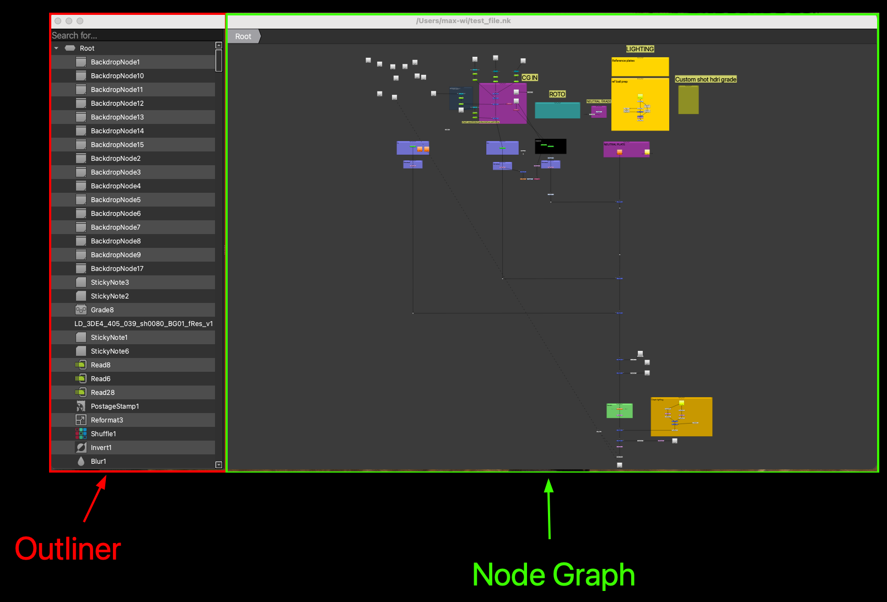
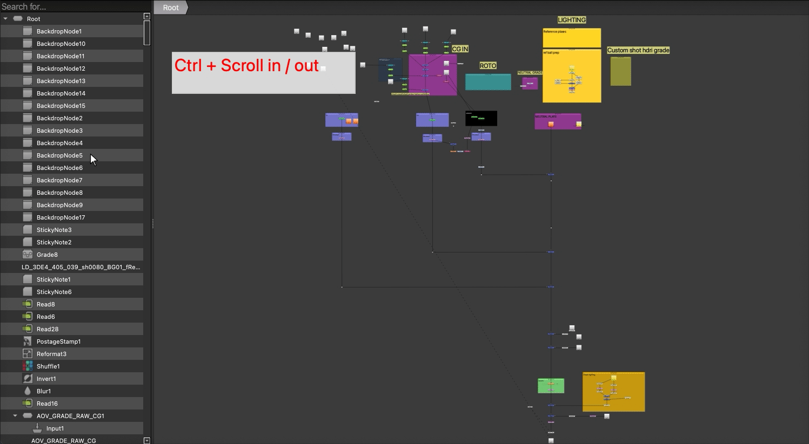
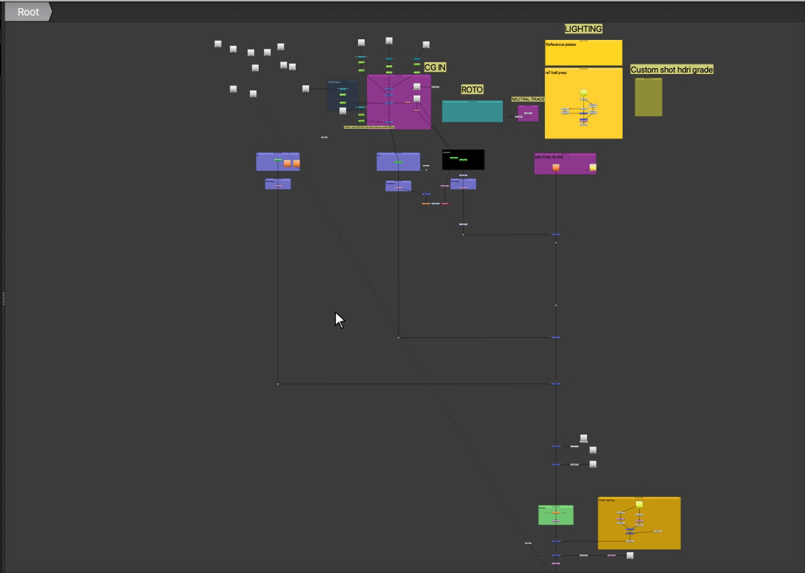
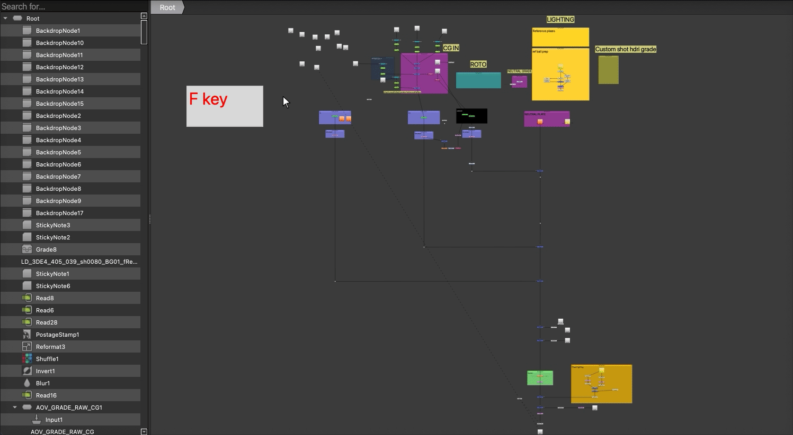
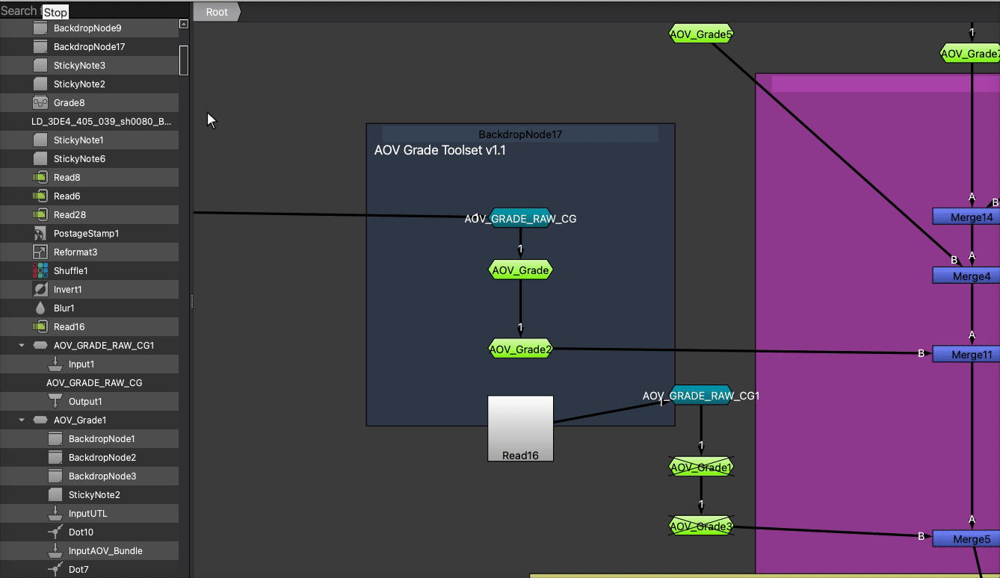
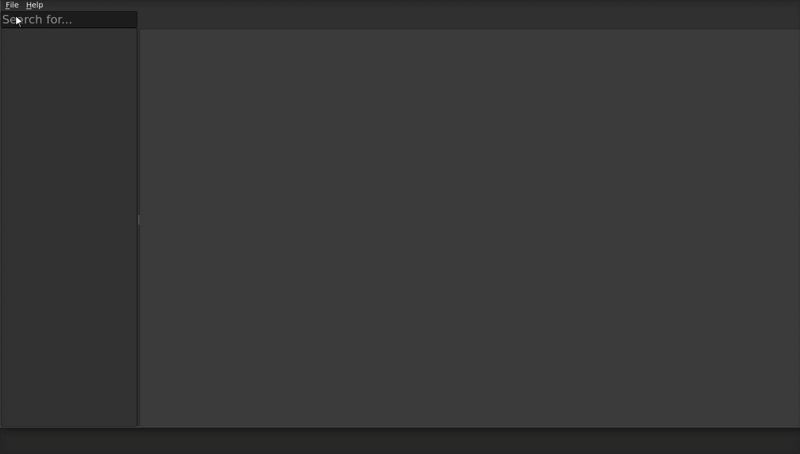

NkView
=======

NkView is an open source, python Qt tool for viewing .nk files.
At the moment the tool supports `PySide2` and `PySide6`.

## Using NkView

Once you have installed nkview, you can launch from the command line:

```
nkview

```

You can also specify a file to open.

```
nkview -o test_scenes/nested_group.nk
```

## Contents
- [Overview](#overview)
  * [Outliner](#outliner)
    * [Zoom in / out](#zoom-in--out)
  * [Node Graph](#node-graph)
    * [Pan And Zoom](#pan-and-zoom)
    * [Frame Selected](#frame-selected)
- [Open Nk File](#open-nk-file)
  * [Open File](#open-from-the-shell)
  * [Open Recent](#open-recent)

## Overview

### Outliner

The Outliner shows a hierarchical list of all objects in the scene in outline form. 
#### Zoom in / out
Press the `Ctrl` key while scrolling to zoom in / out in the outliner.


### Node Graph
The Node Graph presents a schematic of the nk dependency graph, displaying nodes and their connections

#### Pan And Zoom
* To pan with the mouse, press the middle mouse button and drag the mouse pointer over the graph.
* To zoom use the scroll wheel to zoom in / out.
* 

#### Frame Selected
| Action                                                  | How to perform it                                                                                 |
|---------------------------------------------------------|---------------------------------------------------------------------------------------------------|
| Fitting the selected nodes within the visible viewport. | To fit selected nodes in the Node Graph, press F Key.                                             |
| Fitting the node tree within the visible viewport       | To fit the entire node tree in the Node Graph, make sure no nodes are selected and c press F Key. |


#### Groups
The Node Graph allows you to explore nodes inside gizmos and groups. To enter a group or gizmo doubleclick on the node you want to expand in the Node Graph or [Outliner](#outliner).


## Open Nk File
### Open from the shell
```shell
nkview -o path/to/file.nk
```

### Open Recent

